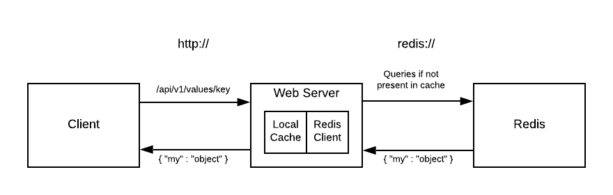

# redis-proxy

Redis Proxy is a service which proxies GET requests to a backing Redis instance but returns the value of a specified key from the proxy's local cache if the local cache contains a value for that key.

## Getting Started

### Prerequisites

Modern Linux distro or Mac OS installation with the following software installed:

1. `make`
2. `docker`
3. `docker-compose`

### Running the proxy

```sh
docker build . -t redis-proxy
docker-compose up -d
```

### Running the tests

```sh
make test
```

This will build and launch a test runner container which connects to both the proxy and the backing redis in order to execute automated system tests.

## Architecture



The web server is built with [Express](https://expressjs.com/) and contains two primary components:

1. Local Cache: implemented with [lru-cache](https://github.com/isaacs/node-lru-cache#readme) which stores key-value pairs for fast retrieval. Global expiry, fixed key size, and LRU eviction come standard.
2. Redis Client: a wrapper around [node-redis](https://github.com/NodeRedis/node_redis) used for querying the backing redis instance

### API

1. `GET /` serves a static how-to page
2. `GET /api/v1/values/some-key` returns the value for the given key as well as a custom response header called `Content-Source` which indicates from where the value is being returned

### Algorithmic Complexity

- Cache hits are O(1)
- Cache misses are O(1 + r) where r is the [Redis access time complexity](https://stackoverflow.com/a/15218599) O(1+n/k) where n is the number of items and k the number of buckets

## Code Structure

```
.
├── .eslintrc.yml // linting rules
├── Dockerfile // builds the redis-proxy image
├── LICENSE // MIT
├── Makefile // single-click build and test
├── README.md
├── docker-compose.yml // defines config for proxy and redis
├── index.html // static page with brief how-to
├── lib
│   ├── cache.js // LRU cache
│   └── redis-client.js // Redis client
├── package-lock.json // describes the exact module tree that was generated
├── package.json // lists the dependencies and project info
├── server.js // proxy entrypoint and main logic. routes are defined here
├── test
│   └── test.js // automated tests with mocha
└── test.Dockerfile // builds the redis-proxy-tests image
```
